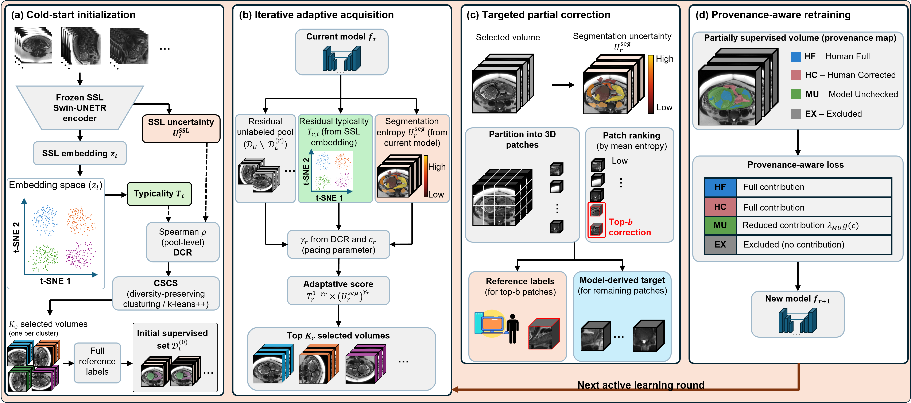

# CSCS-AL-partial: Curriculum Active Learning with Targeted Partial Annotation

**CSCS-AL** jointly addresses two annotation costs in active learning for 3D medical image
segmentation: (1) which volumes to query, at cold-start and at every subsequent round, and
(2) how much of each queried volume actually needs expert correction. A dataset-adapted
cold-start and adaptive iterative acquisition are driven by the **Difficulty-Coverage
Ratio (DCR)**, a label-free scalar computed once from SSL embeddings; an entropy-ranked
**partial correction** strategy restricts expert effort to the most uncertain 3D patches
per queried volume, with a **provenance-weighted loss** that distinguishes human-verified
from model-predicted voxels.

> **Paper**: "Dataset-Aware Curriculum Active Learning with Targeted Partial Annotation
> for 3D Medical Image Segmentation"
> Rémi Hattat, Marine Beaumont, Charline Bertholdt, Gabriela Hossu, Olivier Morel, Bailiang Chen
> IADI (U1254), Inserm and Université de Lorraine, Nancy, France
> *[Citation placeholder — link to be added upon publication]*

> **Note on naming**: this repository covers the *complete* iterative method (cold-start +
> adaptive rounds + partial correction + provenance). [CSCS](https://github.com/rhattat/CSCS-AL)
> is a separate, earlier repository covering *cold-start selection only* (no iterative
> rounds, no partial correction) — check which one matches the paper you are trying to
> reproduce before comparing numbers.



---

## 🧠 Method Summary

```
Cold-start (round 0):
  1. Extract SSL embeddings z_i; compute typicality T(x) and SSL difficulty U_ssl(x)
  2. DCR = Spearman(U_ssl, T)                      <- dataset-level pool geometry
  3. k-means++ into K0 clusters; per cluster, pick argmax T_local^(1-gamma0) . U_local^gamma0

Iterative rounds (r >= 1):
  4. Train task model f_r on the currently labeled set
  5. U_seg_r(x) = mean entropy over f_r's dilated predicted-foreground region (whole-volume fallback)
  6. T_r(x)     = frozen cold-start typicality T(x), restricted to the residual pool's IDs
  7. gamma_r = clip(0.5 + DCR/4 . c_r, 0.3, 0.7),   c_r = |L_r| / (sqrt(N) + |L_r|)
  8. S_r(x) = rank(T_r)^(1-gamma_r) . rank(U_seg_r)^gamma_r   <- top-K_r queried

Partial correction (within each queried volume, r >= 1):
  9. Partition the volume into 3D patches; rank by mean voxelwise entropy
  10. Reveal reference labels on the top-b% patches (-> provenance HUMAN_CORRECTED)
  11. Remaining patches keep the model prediction (-> provenance MODEL_UNCHECKED)
  12. Train with a provenance-weighted loss: w=1 for human-derived voxels,
      w = alpha . g(confidence) for MODEL_UNCHECKED, w=0 for EXCLUDED
```

Gamma adapts to dataset geometry (DCR) and to how much has been labeled so far (`c_r`):
- Positive DCR (hard-to-reconstruct volumes tend to be typical) -> gamma drifts toward
  uncertainty as labeling progresses.
- Negative DCR (hard volumes tend to be peripheral/outliers) -> gamma drifts toward
  typicality, protecting coverage of the common distribution.

---

## ⚙️ Installation

```bash
git clone https://github.com/rhattat/CSCS-AL-partial.git
cd CSCS-AL-partial
pip install -e .
```

**Requirements**: Python ≥ 3.10, numpy, scipy, scikit-learn, pandas, pyyaml. Task-model
training itself requires nnU-Net v2 (`pip install -e ".[nnunet]"`) but is not required to
run cold-start / acquisition / partial-correction selection on precomputed features.

---

## 🚀 Quick Start

### Cold-start selection

```python
import numpy as np
from cscs_al_partial.cold_start import CSCSColdStart

selector = CSCSColdStart(config={"cscs": {"clip_min": 0.3, "clip_max": 0.7}})
result = selector.select(
    pool_ids=pool_ids,        # list[str], length N
    embeddings=embeddings,    # (N, d) SSL embeddings
    U_ssl=U_ssl,               # (N,) SSL reconstruction difficulty
    T_ssl=T_ssl,               # (N,) embedding-space typicality
    k=8,                       # cold-start budget K0
    seed=42,
)
print(result.selected_ids, result.gamma, result.dcr)
```

### Iterative round r >= 1

```python
from cscs_al_partial.acquisition import compute_useg, compute_iterative_scores, compute_gamma_fixed_dcr

gamma_r = compute_gamma_fixed_dcr(n_labeled=len(labeled_ids), n_pool=N, dcr=result.dcr)
U_seg = np.array([compute_useg(npz_path)["useg"] for npz_path in softmax_paths])
scores = compute_iterative_scores(T_ssl=T_residual, U_seg=U_seg, gamma=gamma_r)
query_ids = [pool_ids[i] for i in np.argsort(scores)[::-1][:K_r]]
```

### Partial correction

```python
from cscs_al_partial.partial_correction import (
    rank_patches_by_entropy, apply_partial_correction, build_weight_map, summarize_provenance,
)

patches = rank_patches_by_entropy(entropy_map, patch_size=32)
mixed_label, provenance_map, stats = apply_partial_correction(
    prediction=prediction, reference=reference_label, patch_ranking=patches, budget=0.20,
)
weight_map = build_weight_map(provenance_map, confidence_map, alpha=0.0)  # E2: alpha=0
print(summarize_provenance(provenance_map, weight_map))
```

See `examples/minimal_example.py` for a fully runnable, self-contained walkthrough on
synthetic data (no GPU, no real dataset required).

### Command-line usage

`scripts/` wraps the same three stages as standalone CLI entry points, driven by the
`configs/` YAML files (copy `configs/paths.example.yaml` to `configs/paths.yaml` and
`configs/example_dataset.yaml` to `configs/{your_dataset}.yaml`, then fill in your own
paths/labels):

```bash
python scripts/select_cold_start.py --dataset your_dataset --config_dir configs/ \
    --strategy cscs_curriculum --seed 42 --out selection_round0.json

python scripts/run_iterative_round.py --dataset your_dataset --config_dir configs/ \
    --labeled_ids_file labeled.txt --predictions_dir preds/round1 \
    --dcr 0.42 --k 3 --out selection_round1.json

python scripts/apply_partial_correction.py \
    --entropy_map entropy.npy --prediction pred.npy --reference ref.npy \
    --confidence confidence.npy --budget 0.20 --patch_size 32 --alpha 0.0 \
    --out_dir round1_volXYZ/
```

`run_iterative_round.py` expects softmax probability NPZs already computed by your own
task-model inference (see "What is not included" below); it does not train or run
inference itself.

---

## 🧭 Choosing a Stopping Criterion

`ConvergenceChecker`'s default stopping rule (round-to-round ΔDice) needs a labeled
validation set, which you won't have on a brand-new dataset. Three options, from "just
evaluating the method" to "actually annotating from scratch":

| You have | Use | You get |
|---|---|---|
| Volumes + reference masks (reproducing the paper) | `mode="supervised"` | Real Dice/HD95, exact paper setup |
| Only raw, unlabeled volumes | `mode="stability"` or `"entropy"` | An annotated dataset + a principled stop, **no accuracy number** |
| Raw volumes, can hand-label ~5-10 extra as a "trust set" | `mode="supervised"` on that small set | Real ΔDice stopping, minimal extra annotation cost — **recommended starting point** |

See `docs/method_overview.md` §6 for the full explanation and `acquisition/convergence.py`
for `update()` vs. `update_proxy()`.

---

## 🗄️ Datasets

Three 3D MRI datasets, chosen to span qualitatively distinct DCR regimes — a positive-DCR
small-pool regime (DIANE), a moderate positive-DCR multi-class regime (FeTA), and the only
negative-DCR, largest-pool regime (IBD). $K_0$: cold-start budget; $K_r$: per-round query
budget.

| Dataset | Modality / task | $N_\mathrm{tr}$ | $N_\mathrm{val}$ | Classes | DCR | $K_0$ | $K_r$ |
|---|---|---|---|---|---|---|---|
| **DIANE** (private, NCT04328532) | T2-weighted fetal MRI, 3T (CHRU-Nancy) — fetal body + placenta | 18 | 5 | 2 | +0.68 | 5 | 2 |
| **FeTA** ([challenge](https://feta.grand-challenge.org/)) | T2-weighted fetal brain MRI — fetal brain tissue segmentation | 38 | 10 | 7 | +0.23 | 8 | 3 |
| **IBD** (MR enterography) | 3T HASTE — GI tract (bowel) segmentation, 10 segments | 91 | 23 | 10 | −0.33 | 10 | 10 |

> **Note:** DIANE is a private clinical dataset (CHRU-Nancy, trial NCT04328532) and is
> **not publicly available**. FeTA and IBD are third-party datasets — see their respective
> sources for access and licensing terms.

---

## 🗂️ Repository Structure

```
CSCS-AL-partial/
├── cscs_al_partial/
│   ├── cold_start/           # Round-0 selection: CSCS, Random, ProbCover baselines
│   ├── acquisition/          # Iterative (r>=1) scoring, gamma pacing, convergence check
│   ├── partial_correction/   # Entropy-ranked patch correction + provenance weighting
│   ├── evaluation/           # Dice / HD95 (correct physical-spacing convention, see docstring)
│   ├── io/                   # Config loading, embeddings I/O, run logging
│   └── strategies/           # Registry wiring cold-start + acquisition method pairs
├── configs/          # default.yaml, strategies.yaml, and *.example.yaml templates
├── scripts/          # CLI entry points
├── figures/          # Pipeline figure
├── docs/             # Method overview, data format, reproduction notes
├── examples/         # Minimal runnable example on synthetic data
└── tests/            # Unit tests for the algorithmic core (no GPU / dataset required)
```

**What is *not* included in this release**: the custom nnU-Net trainer (Ranger21-based
optimizer/scheduler + the provenance-weighted-loss trainer variant that consumes the
per-voxel weight maps produced by `partial_correction`) is released separately — see
`docs/method_overview.md` for the interface it expects (a 2-channel target: label +
`round(weight * 1000)` as the second channel). SSL feature extraction (frozen Swin-UNETR,
masked-inpainting pretraining) is likewise documented but not bundled here;
`acquisition`/`cold_start` operate on pre-computed typicality/uncertainty/embedding arrays,
so you can plug in your own SSL backbone.

---

## 🧪 Running Tests

```bash
pip install -e ".[dev]"
pytest tests/ -v
```

---

## 🔁 Reproducibility Notes

- The `acquisition` scoring path percentile-rank normalizes both signals (average-rank
  ties, divided by the residual pool size) before combining them geometrically — not
  min-max normalization.
- `partial_correction.apply_partial_correction`'s `budget` is a **patch-count** fraction,
  not a voxel-weighted cumulative-sum fraction; the realized corrected-voxel fraction can
  exceed the nominal budget when patch sizes vary (e.g. at volume edges).
- `evaluation.hd95` expects `spacing` in the *same* axis order as the array it is computing
  distances on — see the module docstring for the exact convention.

---

## 📝 Citation

```bibtex
@article{hattat2026cscsal,
  title   = {Dataset-Aware Curriculum Active Learning with Targeted Partial Annotation
             for 3D Medical Image Segmentation},
  author  = {Hattat, R{\'e}mi and Beaumont, Marine and Bertholdt, Charline and
             Hossu, Gabriela and Morel, Olivier and Chen, Bailiang},
  journal = {TBD},
  year    = {2026},
}
```

---

## 📜 License

MIT — see [LICENSE](LICENSE).

---

*This repository contains the method implementation only. It does not include medical
imaging datasets, SSL checkpoints, or nnU-Net training results.*
